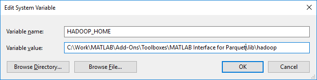

[//]: #  (Copyright 2017, The MathWorks, Inc.)

# Setup for Microsoft® Windows®

To write Parquet files using MATLAB on Windows, the install should have guided
the user through the additional steps required. If any of the steps
were deferred for later, then this guide goes into detail on how to go
through the setup manually.

## Check install for Windows
To verify all is setup correctly run the below command:

```matlab
parquetwin('verify')
```

If everything is OK, you should see the below and can skip the rest of this guide.
```
1. Checking HADOOP_HOME ✔
2. Checking winutils install ✔
3. Testing winutils ✔
```

The below documents the steps needed to fix any of the above  setup issues.

## Set HADOOP_HOME
If you ran ```parquet('verify')``` and got the below message,
where *C:\MyFolder\ParquetInstallfolder* is the folder where the
Parquet code is installed on your machine:

```
1. Checking if HADOOP_HOME has been set:
There is a problem with the System environment variable HADOOP_HOME, this value needs to be set to the following:
C:\MyFolder\ParquetInstallfolder\MATLAB\lib\hadoop
Please ensure you paste this value into System environment variable HADOOP_HOME, and then restart MATLAB.
See Help > Supplemental Software > MATLAB Interface for Parquet Toolbox > Getting Started for more information.
```
 Run the following command, this will display the value needed for HADOOP_HOME
```matlab
parquetwin('hadoop_home')
```
Next, open the environment variables editor in Windows, and paste the
HADOOP_HOME System variable. It should look something like this:

  

## Download winutils
If you ran ```parquet('verify')``` and got the below message, where
*C:\MyFolder\ParquetInstallfolder* is the folder where the Parquet code is
installed on your machine:

```
2. Checking if winutils.exe is installed:
To write Parquet files on Windows save:
https://github.com/steveloughran/winutils/raw/master/hadoop-2.8.3/bin/winutils.exe
To the folder:
C:\MyFolder\ParquetInstallfolder\MATLAB\lib\hadoop\bin

```

## Testing winutils
If you ran ```parquetwin('verify')``` and got the below message:

```
3. Testing winutils
If you see a MSVCR100.dll is missing message popup then you will need to install:
Microsoft Visual C++ 2010 SP1 Redistributable Package (x64)
 https://www.microsoft.com/en-US/download/details.aspx?id=13523
```

This can occur in situations like a clean Windows Server 2016 install on
Azure for instance, and the most likely cause is a missing DLL.

If you see a MSVCR100.dll is missing message then you will need to install
the [Microsoft Visual C++ 2010 SP1 Redistributable Package (x64)](https://www.microsoft.com/en-US/download/details.aspx?id=13523)

## Restart MATLAB
Always restart MATLAB after install or after setting HADOOP_HOME
